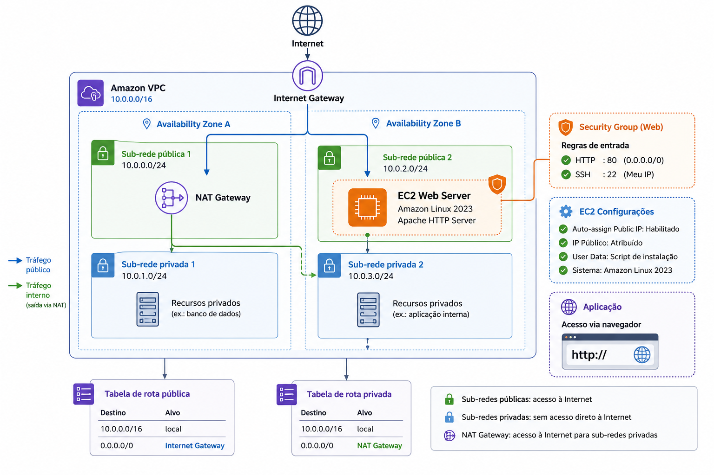
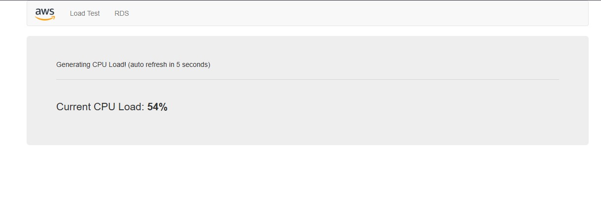

# ☁️ AWS re/Start Lab | Build a VPC and Deploy a Web Server


<p align="center">


</p>

<p align="center">

Laboratório desenvolvido durante a formação <strong>AWS re/Start</strong>, oferecida pela <strong>Escola da Nuvem</strong>, documentando a criação de uma infraestrutura completa na AWS com implantação automática de um servidor web utilizando Amazon EC2.

</p>

---

# 🚀 Sobre o Projeto

Este repositório documenta um laboratório prático realizado durante a formação **AWS re/Start**, da **Escola da Nuvem**.

Mais do que executar o laboratório, o objetivo foi compreender cada recurso utilizado, registrar todas as etapas da implantação e documentar a resolução dos problemas encontrados durante a execução.

Durante o desenvolvimento foi necessário adaptar parte do laboratório devido às mudanças do **Amazon Linux 2023**, utilizando análise de logs do sistema para identificar e corrigir o problema.

Toda a documentação foi reorganizada em formato de guia para facilitar futuras consultas e auxiliar outros estudantes.

---

# 🎯 Objetivos

✔ Criar uma Amazon VPC

✔ Criar sub-redes públicas e privadas

✔ Configurar Internet Gateway

✔ Configurar Route Tables

✔ Criar Security Groups

✔ Provisionar uma instância Amazon EC2

✔ Automatizar a instalação do Apache utilizando User Data

✔ Publicar uma aplicação Web

✔ Diagnosticar problemas utilizando logs do sistema

---

# 🏗 Arquitetura

<p align="center">


</p>

---

# 🛠 Tech Stack

<p align="center">


</p>

<p align="center">


</p>

---

# ☁️ Serviços AWS utilizados

| Serviço | Finalidade |
|----------|------------|
| Amazon VPC | Rede privada virtual |
| Amazon EC2 | Máquina virtual Linux |
| Internet Gateway | Comunicação com Internet |
| Route Tables | Roteamento |
| Security Groups | Firewall |
| Amazon Linux 2023 | Sistema Operacional |
| Apache HTTP Server | Servidor Web |

---

# 📂 Estrutura da Infraestrutura

```text
Internet
     │
     ▼
Internet Gateway
     │
     ▼
Public Route Table
     │
     ▼
Public Subnet
     │
     ▼
Amazon EC2
     │
     ▼
Apache HTTP Server
     │
     ▼
Website
```

---

# ⚙️ User Data utilizado

```bash
#!/bin/bash

dnf install -y httpd php wget unzip

systemctl enable httpd
systemctl start httpd

wget https://aws-tc-largeobjects.s3.us-west-2.amazonaws.com/CUR-TF-100-RESTRT-1/267-lab-NF-build-vpc-web-server/s3/lab-app.zip

unzip lab-app.zip -d /var/www/html/
```

---

# 📸 Evidências

## Amazon VPC

 

---

## Componentes da Arquitetura

<table>
  <tr>
    <td align="center">
      <strong>🛡️ Security Group</strong><br><br>
      
    </td>
    <td align="center">
      <strong>🖥️ Amazon EC2</strong><br><br>
      
    </td>
    <td align="center">
      <strong>🌐 Servidor Web</strong><br><br>
      
    </td>
  </tr>
</table>

---

# 🔍 Troubleshooting

Durante a execução do laboratório foi identificado que o script disponibilizado originalmente pela AWS não era totalmente compatível com a versão atual do Amazon Linux 2023.

Em vez de modificar o script por tentativa e erro, foi realizada uma investigação baseada em evidências utilizando inicialmente os **System Logs da instância no Console da AWS** e, posteriormente, os logs diretamente pela linha de comando.

Essa abordagem permitiu identificar rapidamente a origem da falha e validar a solução aplicada.

---

## Processo de investigação

### 1️⃣ Análise do System Log da instância (AWS Console)

Após a inicialização da EC2, foi acessado:

**EC2 → Actions → Monitor and troubleshoot → Get system log**

O log indicou que o processo de inicialização (**Cloud-Init**) havia encontrado erros durante a execução do **User Data**, sinalizando que o Apache não havia sido instalado corretamente.

> Essa foi a primeira evidência utilizada para iniciar o processo de diagnóstico.

---

### 2️⃣ Validação pela CLI

Após conectar à instância via **EC2 Instance Connect**, foi verificado o status do serviço:

```bash
systemctl status httpd
```

Resultado:

```text
Unit httpd.service could not be found.
```

Isso confirmou que o Apache realmente não havia sido instalado.

---

### 3️⃣ Investigação do Cloud-Init

Para entender por que o User Data havia falhado:

```bash
sudo cat /var/log/cloud-init-output.log
```

Esse log apresentou os detalhes da execução do script durante o boot da instância, permitindo localizar a origem do problema.

---

### 4️⃣ Conferência do User Data recebido

```bash
sudo cat /var/lib/cloud/instance/user-data.txt
```

Essa etapa confirmou exatamente qual script havia sido recebido e executado pela instância.

---

### 5️⃣ Correção aplicada

Após identificar a causa da falha, o script foi adaptado para o Amazon Linux 2023 utilizando:

- `dnf` como gerenciador de pacotes;
- instalação correta do Apache HTTP Server;
- inicialização automática do serviço (`systemctl enable` e `systemctl start`);
- download e extração da aplicação web;
- ajuste das permissões necessárias para o diretório do servidor web.

---

## Resultado

✔ Apache instalado com sucesso

✔ Serviço iniciado automaticamente

✔ Aplicação Web publicada

✔ Instância acessível via navegador

✔ Diagnóstico realizado utilizando evidências do Console da AWS e da CLI
---

# 💡 Principais Aprendizados

Durante este laboratório foram praticados conceitos importantes de Cloud Computing:

- Planejamento de redes na AWS
- CIDR e Sub-redes
- Internet Gateway
- Route Tables
- Security Groups
- Amazon EC2
- Apache HTTP Server
- Amazon Linux 2023
- User Data
- Cloud-Init
- Diagnóstico através de logs
- Troubleshooting em ambientes Cloud

---

# 📚 Documentação

Este repositório possui uma documentação própria criada durante os estudos contendo:

- Passo a passo completo
- Configurações realizadas
- Capturas de tela
- Problemas encontrados
- Soluções adotadas
- Observações para versões atuais da AWS

O objetivo é servir como material de revisão e também auxiliar outros estudantes da formação AWS re/Start.

---

# ✅ Resultado Final

<p align="center">

</p>

A aplicação foi implantada com sucesso em uma instância Amazon EC2 utilizando Apache HTTP Server, acessível por meio do endereço IPv4 público.

---

# ⭐ Destaque Técnico

O maior aprendizado deste laboratório não foi apenas provisionar a infraestrutura, mas compreender como diagnosticar falhas em um ambiente Linux na AWS.

A análise dos logs gerados pelo **Cloud-Init** permitiu identificar rapidamente a origem do problema, validar o User Data executado pela instância e adaptar o script para a versão atual do Amazon Linux.

Essa experiência reforçou a importância da investigação baseada em evidências, prática essencial para profissionais de Cloud Computing, Infraestrutura e DevOps.

---

# 👨‍💻 Autor

**Ruben Neto**

🎓 Tecnólogo em Análise e Desenvolvimento de Sistemas

☁️ Estudante da formação AWS re/Start — Escola da Nuvem

🎨 Designer Gráfico em transição para Cloud Computing

📍 Minas Gerais - Brasil

---

## ⭐ Se este material foi útil

Considere deixar uma ⭐ no repositório.
